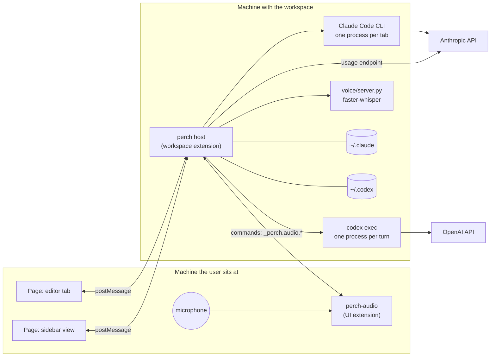
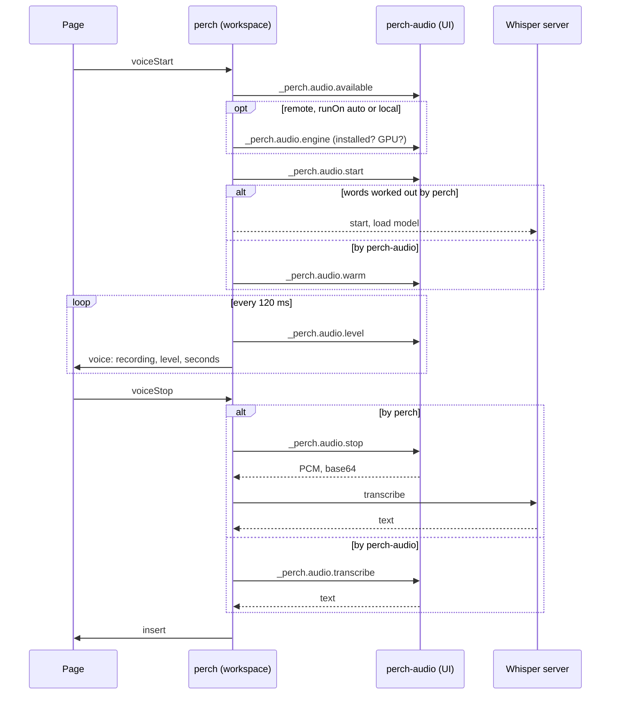

# perch: design

Version 0.6.0, 2026-09-30. This document describes perch as built, the
reasons behind its shape, and what has and has not been verified. Setup
and everyday use are in [README.md](README.md).

## Contents

1. [Purpose](#1-purpose)
2. [Why a shell and not an agent](#2-why-a-shell-and-not-an-agent)
3. [Token economy: how the reuse is achieved](#3-token-economy-how-the-reuse-is-achieved)
4. [Architecture](#4-architecture)
5. [Sessions and surfaces](#5-sessions-and-surfaces)
6. [State, replay, and persistence](#6-state-replay-and-persistence)
7. [The page protocol](#7-the-page-protocol)
8. [The agents](#8-the-agents)
9. [Model catalogs](#9-model-catalogs)
10. [The composer](#10-the-composer)
11. [Usage meters](#11-usage-meters)
12. [Dictation](#12-dictation)
13. [Security and privacy](#13-security-and-privacy)
14. [Testing](#14-testing)
15. [Verified and not verified](#15-verified-and-not-verified)
16. [Limitations and open work](#16-limitations-and-open-work)
17. [Decision log](#17-decision-log)
18. [References](#18-references)

## 1. Purpose

perch puts Claude Code and Codex in one VS Code extension: any number of
sessions of either kind, each in its own tab, each looking and behaving
like its vendor's own panel.

It exists because running two vendor extensions means two panels, two
sets of habits, and no way to pass work between them, while the tools
that do unify models do it by replacing the agent.

The reason it is written this way, rather than adopting Continue or
another harness that already unifies models, is token usage. perch reuses
the vendors' own agents, the Claude Code CLI and the Codex CLI, whole:
their prompt layout, their caching, their compaction, their logins. It
adds no request of its own. Section 2 argues the choice; section 3 sets
out how the reuse is achieved and what it was measured to cost.

## 2. Why a shell and not an agent

An **agent** is the program that runs the loop: it decides what goes
into each request, receives the model's requests to read, run, and
edit, executes them, and feeds back the results. A **model** only
produces text. Whoever runs the loop owns the tools, the permissions,
and the cost.

perch does not run the loop. Each tab starts the vendor's agent through
the vendor's SDK and renders its event stream. This is the central
decision, and the reason is cost.

### The cost of replacing the agent

An agent does not send one request per message. It sends one per step,
and each carries the whole conversation. A 20-step task whose context
grows by about 3k tokens a step sends on the order of 930k input tokens.
Prompt caching is what makes that affordable: a cache hit is billed at
0.1 times the input rate, a write at 1.25 times.

A cache hit needs a **byte-identical prefix**. So caching is not a header
to add. It is a property of how the whole prompt is laid out and kept
stable from call to call, which only the agent controls.

| Harness, with Claude as the model | Cache markers | Prefix kept stable | Cache lifetime | Billing |
| --- | --- | --- | --- | --- |
| Claude Code | placed by the agent | yes, by design | 1 hour on a subscription | subscription, or API |
| OpenCode | first two system messages and last two conversation messages | largely: a purpose-built coding agent | 5 minutes | API, per token |
| Continue | opt-in, coarse (`cacheBehavior`) | no: context providers re-render near the front | 5 minutes | API, per token |
| Continue behind LiteLLM | injected at the gateway | no, same | 5 minutes | API, per token, capped |

OpenCode's row was checked against its source
(`packages/opencode/src/provider/transform.ts`, `applyCaching`). Its
caching is sound. What it lacks relative to Claude Code is the one-hour
lifetime and subscription billing, not the markers. Continue's weakness
is the prefix, which a gateway cannot repair because it sits below the
harness.

The same reasoning applies on the other side: Codex's agent manages its
own caching against OpenAI's API.

### What follows from the decision

- perch never constructs a model request. It cannot break caching,
  because it does not take part in it.
- Permissions, memory, skills, hooks, `CLAUDE.md`, MCP servers, and
  compaction are the vendor's, unchanged.
- Two agents means two contexts. Tabs do not share history. The one
  bridge is **handoff**, which pastes a tab's last answer into another
  tab's message box. Shared context would defeat each agent's caching.
- Both agents run on the user's existing logins. That is a personal-use
  arrangement. Distributing perch to others would require API-key
  billing under both vendors' terms.

## 3. Token economy: how the reuse is achieved

### What a turn costs

An agent's turn is a loop of model calls, one per step, and each call
carries the whole conversation: system prompt, tool definitions, every
message and tool result so far, then the new step. The cost of a turn is
therefore dominated by the size of the conversation, not by what the
user just typed. Two things keep it affordable:

- **Prompt caching.** A call whose prefix is byte-identical to a recent
  one is billed at 0.1 times the input rate for the cached part; writing
  the cache costs 1.25 times. On a subscription the cache lives an hour
  after each answer; on the API, Bedrock, Vertex, or Foundry, five
  minutes. With a 100k-token conversation, a cached step bills the
  equivalent of about 10k input tokens; a cold one about 125k. The whole
  economy of a long session rests on staying cached.
- **Compaction.** When the conversation nears the window, the agent
  summarises it. Done well, the summary keeps what the rest of the task
  needs; done badly, or too often, the model re-reads files it had.

Caching needs the prefix to be stable, so it is a property of how the
agent lays out and reuses the prompt. Compaction needs judgement about
the task, so it is a property of the agent too. perch's approach is to
own neither: it runs each vendor's agent as the vendor's own terminal
would, and only shows what happens.

### The mechanisms

1. **No request of perch's own.** perch never assembles a prompt, never
   inserts a system message, never re-renders a context provider near
   the front of the conversation. The prompt an agent sends from a perch
   tab is the prompt it would send from a terminal, so its cache hits
   are the terminal's cache hits. Everything the page shows is derived
   from the agent's event stream, not requested from a model.

2. **One conversation per tab, kept alive.** A Claude tab is one Claude
   Code process fed messages over its lifetime (the SDK's streaming-input
   mode). Every turn extends the same conversation, so the prefix grows
   at the end and the cache written by one turn is read by the next. A
   message sent mid-turn is queued in that same process, not sent as a
   new conversation. Mode and effort changes are applied to the running
   session rather than by restarting it.

3. **A Codex thread continued, not replayed.** The Codex SDK runs each
   turn as a `codex exec` process that resumes the thread by id. What
   goes to the model is the thread as Codex itself recorded it, with the
   same prefix each time, so OpenAI's prefix caching applies as it does
   from the Codex CLI. A model, effort, or sandbox change is made by
   taking the thread up again with the new setting; Codex then compacts
   once, which is the one token cost of switching.

4. **Resume by the agent's own id.** A tab that is reopened, or brought
   back after a window reload, hands the agent its session id. The agent
   continues the transcript it kept, with its own compaction state. perch
   does not re-send history, summarise it, or hold a copy that could
   drift from the agent's. The transcript the page shows after a resume
   is read from the agent's file on disk: a file read, no tokens.

5. **The system prompt is the SDK's, which is smaller.** Started through
   the Agent SDK without a `systemPrompt` option, Claude Code runs with
   the SDK's default prompt rather than the full Claude Code prompt.
   Measured on 2026-09-30 with a one-line question on Haiku: **15,226
   tokens** written to the cache on the first turn as perch runs it,
   against **21,581** with `systemPrompt: { type: 'preset', preset:
   'claude_code' }`. The difference is paid once per session and again on
   every cache miss. What is lost is Claude Code's own guidance on how to
   work; `CLAUDE.md`, settings, skills, hooks, and MCP servers are still
   loaded, because the SDK loads all setting sources by default.
   Switching to the preset is one line in `src/claudeAgent.js` if parity
   with the terminal matters more than the tokens.

6. **Nothing else perch does touches a model.** Opening a tab starts no
   process. Model lists come from a Claude Code process started without
   a message, and from Codex's `models_cache.json`. The sessions list,
   renaming, and the transcript reader work on the agents' files.
   Context usage is asked of the running Claude process locally. Claude's
   usage gauge reads Anthropic's usage endpoint, which reports limits and
   costs no tokens; Codex's is read from the last `token_count` event in
   its session files. Dictation is local Whisper.

7. **No shared context between tabs.** Two tabs are two conversations.
   The only bridge, handoff, pastes one tab's last answer into another's
   message box, so the receiving agent sees a message, not a transplanted
   history that would invalidate its prefix and duplicate its context.

8. **The cache clock.** The composer shows how long the prompt cache
   stays warm after the last answer, so a follow-up can be sent before it
   goes cold. It is a display of the agent's timing, not a mechanism of
   perch's; it exists because the difference between a warm and a cold
   turn is the 12-fold one above.

### What a perch tab spends that a terminal would not

| Cost | When | Size |
| --- | --- | --- |
| IDE context on a message | With the toggle on, which it is by default | The active file's selection, up to 12,000 characters |
| Compaction on a Codex model switch | Only when the model is changed mid-thread | One compaction of the thread |
| A pasted image | Only when one is sent | Scaled to at most 1568 px on the long side, the most the API keeps; roughly 1,800 tokens for a full-width screenshot, by the vendors' area-based estimates. Past 20 images in a conversation the API refuses any image of 2000 px or wider (measured: 2000 exactly is refused), and the agent keeps every earlier image until it compacts; the tab says so at the twentieth |

Nothing else. In particular perch adds no per-message instructions, no
retrieval, no summaries, and no hidden calls.

### Comparison

Section 2 compares the harnesses. In these terms: OpenCode caches
soundly but on API billing with a five-minute lifetime; Continue's
context providers re-render near the front of the prompt, so its prefix
is not stable and a gateway below it cannot make it so. Both replace the
vendor's agent, so neither gets its compaction or its subscription
billing. perch gets both because it changes nothing in the agent.

### How to see it

Each turn's result line in the transcript shows the agent's own usage
figures: tokens in, tokens read from cache, tokens out, and for Claude
the cost. A warm turn shows nearly all of its input as cached. The
figures come from the agents (`result` messages from Claude Code,
`turn.completed` from Codex), not from an estimate of perch's.

### Not verified

- Codex's cache behaviour is inferred from the SDK's design (one thread,
  resumed by id, the same prefix) and its `cached_input_tokens` figures,
  not from OpenAI's cache keys, which the SDK does not expose.
- The image token figure is the vendors' published estimate, not a
  measurement.

## 4. Architecture



In a local window both boxes are the same machine. Under Remote-SSH they
are two, and the split between them is what makes dictation possible
(section 12).

### Modules

| File | Lines | Depends on VS Code | Responsibility |
| --- | --- | --- | --- |
| `src/extension.js` | 877 | yes | Sessions, surfaces, routing, persistence, commands, the sessions list |
| `src/webview.js` | 774 | no | The page: markup, styles, and script, as one template |
| `src/markdown.js` | 126 | no | An answer's Markdown, drawn as DOM nodes; written into the page as source |
| `src/sessionStore.js` | 257 | no | Past sessions, their names, and their transcripts, from the agents' records |
| `src/binaries.js` | 52 | no | Where the agents' programs are: the SDK's own, or the vendor extension's |
| `src/claudeAgent.js` | 190 | no | One Claude Code session through the Agent SDK |
| `src/gateway.js` | 95 | no | The gateway file: reading it, what makes it usable, the environment a tab gets, the template |
| `src/relay.js` | 90 | no | The loopback relay between a gateway tab's Claude Code and the gateway: forwards unchanged, reads which model answered |
| `src/codexAgent.js` | 185 | no | One Codex thread through the Codex SDK |
| `src/models.js` | 91 | no | Model and slash-command catalogs, read from the agents |
| `src/meter.js` | 426 | no | Claude usage, cost, the backend switch, cache lifetime |
| `src/codexMeter.js` | 101 | no | ChatGPT plan usage, read from Codex's session files |
| `src/meterHost.js` | 185 | yes | Polling, back-off, the backend switch, login |
| `src/voice.js` | 157 | no | The speech-to-text engine: environment, server process |
| `src/voiceHost.js` | 135 | yes | Dictation: recorder to engine to message box |
| `voice/server.py` | 140 | n/a | faster-whisper behind JSON lines |
| `audio/src/recorder.js` | 120 | no | Microphone capture and device choice |
| `audio/src/extension.js` | 86 | yes | perch-audio's commands |

**A rule the layout enforces:** logic that can be written without the
VS Code API is, and takes its home directory, environment, and
collaborators as parameters. Thirteen of the eighteen files have no VS Code
dependency, which is why most of the behaviour is tested against
throwaway directories and stand-in processes with no editor running.

### Dependencies

| Package | Version | Why |
| --- | --- | --- |
| `@anthropic-ai/claude-agent-sdk` | 0.3.284 | Runs Claude Code. Installed from npm it brings its own CLI; packaged, perch uses the Claude Code extension's |
| `@openai/codex-sdk` | 0.159.0 | Runs Codex. Installed from npm its dependency brings `codex`; packaged, perch uses the ChatGPT extension's |
| `@picovoice/pvrecorder-node` | 1.2.9 | Microphone capture, in perch-audio. Prebuilt for macOS, Linux, Windows |
| `faster-whisper` | 1.2.1 | Speech-to-text, in a private Python environment |
| `jsdom` | 25 | Development only: runs the page script in tests |

Both SDKs are ES modules. The extension is CommonJS, so they are loaded
with a dynamic `import()`.

## 5. Sessions and surfaces

A **session** is one tab: one agent, one context. A **surface** is a page
that shows sessions. There are two kinds.

| Surface | Shows | Tab bar | VS Code API |
| --- | --- | --- | --- |
| Editor tab | one session | VS Code's own | `WebviewPanel`, `WebviewPanelSerializer` |
| Sidebar view | every session that lives in the sidebar | perch's own, in the page | `WebviewView` |

`perch.newTabs` chooses where new tabs open, `editor` by default.

### Why editor tabs

A view docked in a sidebar carries two rows of VS Code's own chrome: the
container icon row and the view title. An extension cannot remove them.
The editor area has neither, so there the tab row is the first line.
This is also how Claude Code's own extension presents its sessions.

### Routing

The host does not assume one page. Each session has a `location`, and
every message is sent to the surface that shows that session:

| Message | Goes to |
| --- | --- |
| A session's events | the surface showing that session |
| `tabs` | the sidebar gets its sessions; each editor tab gets its one, with `single: true` |
| Usage, slash commands | every page |

### Native tab titles

An editor tab cannot draw the status dots that the sidebar's tab bar
does, so status goes in the title:

| State | Title |
| --- | --- |
| Idle | `fix the flush bug` |
| Working | `fix the flush bug …` |
| Permission prompt waiting, tab hidden | `● fix the flush bug` |

### Closing and moving

Closing an editor tab closes the session and stops its agent. The host
tells that apart from a tab that goes away for another reason, a move
or a shutdown, so that neither closes a session by accident.

A tab can be moved between surfaces. The session, its agent, and its
transcript are untouched; only its `location` changes and the new
surface is sent a replay.

## 6. State, replay, and persistence

### The host owns everything

VS Code destroys and recreates a webview whenever a view is moved
between sidebars, and again on reload. A page therefore cannot be trusted
to hold state. The host records every transcript event, the status, the
busy flag, pending permission prompts, and drafts that arrive for a page
that is not there. When a page announces `ready`, it is sent a replay.

This was learned from a bug: the first version announced "ready" once,
so a moved view showed "starting…" forever and lost its transcript.

**Rule:** any new state the page shows must be recorded in the host and
included in the replay, or it will be lost the first time a view moves.

Details that follow from it:

- Streaming deltas are not recorded. The final text covers them.
- A pending permission prompt replays as a prompt. An answered one
  replays as a one-line note, so it cannot be answered twice.
- History is capped at 2000 events a session.

### Persistence

Saved in `workspaceState` under `perch.sessions.v1`: for each session its
id, kind, title, mode, effort, model, IDE-context flag, location, and the
**agent's own session id**. The transcript is not saved.

On reload a tab resumes by handing that id back to the agent
(`resume` for Claude, `resumeThread` for Codex). The agent has the
conversation on disk. The transcript shown in the tab is read back from
the agent's own record, by `src/sessionStore.js`: the Agent SDK's
`getSessionMessages` for Claude, the rollout file for Codex. The last
thousand entries are shown; a note says how many earlier ones are not.
Until the record has been read, or if it cannot be, the tab says the
earlier transcript is not shown. No tokens are spent on any of this.

A tab's name is saved with the tab and also written to the agent's own
record of the session (`renameSession` for Claude; a line appended to
`~/.codex/session_index.jsonl` for Codex), so the vendors' own clients
show the same name. A name given before the first turn is written when
the first turn ends, since the record does not exist before then.

Tab counters are saved too. Rebuilding them by counting restored tabs
let a new tab reuse the name of an open one; a test caught that.

### Restoring editor tabs

1. The page of an editor tab calls `setState({ sid })`.
2. After a reload VS Code calls `deserializeWebviewPanel(panel, state)`.
3. The host attaches that panel to the session, or disposes it if the
   session is gone, has moved, or already has a tab.
4. VS Code brings a tab back lazily: one behind another has no page
   until it is shown. After a four-second wait, a session with no page
   is checked against the tabs VS Code still holds (`tabGroups`); only a
   session with no tab at all is given one. The first version opened a
   tab for every session without a page, which duplicated the tabs that
   were merely waiting.

A tab saved before editor tabs existed has no `location`. It takes the
current setting, which migrates old sidebar tabs on the next reload.

## 7. The page protocol

The page and the host exchange plain JSON with `postMessage`.

### Page to host

| Type | Fields | Meaning |
| --- | --- | --- |
| `ready` | | The page has loaded and wants a replay |
| `send` | `sid`, `text` | A message. Queued if the agent is working |
| `stop` | `sid` | Stop the turn and drop what is queued |
| `permission` | `sid`, `id`, `decision` | `allow`, `always`, or `deny` |
| `setModel`, `setEffort`, `setMode` | `sid`, `value` | A choice from a menu |
| `setIde` | `sid`, `value` | IDE context on or off |
| `setBackend` | `sid`, `value` | A Claude tab's backend from the footer's menu: `subscription` or `api` (the window's, through its switch), or `gateway` (this tab's) |
| `attach` | `sid` | Open the file picker for mentions |
| `new`, `close`, `activate` | `kind` (and `gateway` for a Claude tab on the gateway) or `sid` | Sidebar tab bar |
| `meterRefresh` | `vendor` | Re-read usage |
| `meterToggle`, `meterLogin` | | Claude backend switch, login |
| `voiceStart`, `voiceStop`, `voiceCancel` | `sid` | Dictation |

### Host to page

| Type | Fields | Meaning |
| --- | --- | --- |
| `tabs` | `tabs`, `active`, `single`, `gateway` | The sessions this page shows; `gateway` says where the gateway file is, whether it exists, and whether it is in order |
| `event` | `sid`, `ev` | One event for one session |
| `meter` | `meter`, `codex` | Claude usage, and ChatGPT plan usage |
| `commands` | `kind`, `list` | Slash commands |

### Event kinds

| Kind | Recorded for replay | Shown as |
| --- | --- | --- |
| `user` | yes | A message bubble, tagged if queued or carrying IDE context |
| `text`, `thinking` | yes | The agent's answer, its reasoning |
| `delta` | no | Streaming text in a live bubble |
| `tool_use`, `tool_result` | yes | A tool call with its result beneath |
| `permission` | yes, becomes a `note` once answered | Allow, Always, Deny |
| `question` | yes, becomes `answered` | Claude's `AskUserQuestion`: choices as buttons, a line of your own, one answer for all |
| `result` | yes | Duration, tokens in, cached, out; through a gateway, `via`: the models that answered the turn's requests, each with a count, and `gatewayCost`, `gatewayCostSoFar`: the gateway's own figures, for the turn and the session |
| `note`, `error` | yes | A line in the transcript |
| `status`, `busy` | latest value only | A working line at the foot of the transcript: what the agent is doing, for how long. A status that is not idle, working, or ready becomes a `note` |
| `fill`, `insert` | no, held as a draft if no page | Text into the message box |
| `voice` | no, re-sent on `ready` | The microphone's state |

Agents emit a few more that the host consumes and does not forward:
`session`, `model`, `context`, `responded`, `commands`, and `relay` (one
response through the gateway: which model it came from, folded into the
next `result` as `via` and onto the tab as its last model).

## 8. The agents

Both agent modules take an `emit` callback and know nothing of VS Code.
They translate the vendor's events into the kinds above.

### Claude

| Aspect | How |
| --- | --- |
| Process | One CLI process per tab, in **streaming-input** mode: `query({ prompt: asyncIterable })` |
| Why one process | Every turn shares the same prompt cache and context |
| Permissions | `canUseTool` calls back on each tool use. The page shows the prompt. "Always" returns the SDK's own suggestions as `updatedPermissions` |
| Mode, model, effort | Live, on the running session: `setPermissionMode`, `setModel`, `applyFlagSettings({ effortLevel })` |
| Queueing | A message sent mid-turn is pushed with `priority: 'next'`. Claude Code queues it |
| Context usage | `getContextUsage()` after each turn |
| Slash commands | `supportedCommands()` |
| Stop | `interrupt()` |
| Settings | All sources are loaded, the SDK's default, so the user's `~/.claude/settings.json` applies |
| Environment | The extension host's, plus, for a tab on the gateway, the variables of the user's gateway file (`src/gateway.js`) with `CLAUDE_CODE_USE_BEDROCK=0` unless the file says otherwise; and the same variables, the token left out and the base URL the relay's, as the process's own settings (the SDK's `settings`, Claude Code's `--settings`), which Claude Code applies over `~/.claude/settings.json`. Without that a window set to API / Bedrock there sends the tab to Bedrock whatever its environment says, since the settings' `env` block is applied over the environment |
| Relay | On the gateway, `ANTHROPIC_BASE_URL` is a loopback port of perch's (`src/relay.js`), one per process, started before the CLI and stopped with it. Every request is forwarded to the gateway as it came, path prefix kept, token included, and the response streamed back byte for byte; the relay only reads the gateway's `x-litellm-*` headers, which name the deployment that answered. Nothing a model sees changes. A gateway that sets no such header is relayed the same and reports nothing |
| System prompt | The SDK's default, not Claude Code's full prompt: about 6,400 tokens smaller (section 3) |
| Questions | `AskUserQuestion` arrives through `canUseTool`; the answers go back as `updatedInput.answers` |
| Images | Pasted images go as base64 `image` blocks before the text |

Claude Code auto-approves a set of read-only shell commands such as
`echo` without prompting. That is the agent's behaviour, not a gap in
perch. A `Write` prompts every time in default mode.

### Codex

| Aspect | How |
| --- | --- |
| Process | The SDK wraps `codex exec`: one process per turn, one thread across turns |
| Approvals | **By policy, not by prompt.** `codex exec` is non-interactive. `perch.codex.approvalPolicy` and the sandbox decide |
| Model, effort, sandbox | Changed from the next turn: the thread is taken up again (`resumeThread`) with the new options. Codex compacts once and notes the model change |
| Images | Written to a private temporary directory and passed as `local_image` inputs; removed with the agent |
| Queueing | One turn at a time, so **perch holds the queue** and drains it as each turn ends, without the tab flickering to idle |
| IDE context | Attached by perch (below) |
| Stop | An `AbortSignal` on the turn |

### IDE context

On both kinds of tab; on by default for new tabs (`perch.ideContext`), and
kept per tab. When on, a message carries the active file and, if there is
one, the selection:

````
why is b 2?

<ide_context>
Active file: src/a.js (javascript)
Selection: lines 3-4
```javascript
const a = 1;
const b = 2;
```
</ide_context>
````

- The transcript shows the message and a tag, `IDE context · src/a.js:3-4`,
  not the attachment.
- It is read **when the message is written**, so a queued message keeps
  the file that was open then.
- A selection over 12000 characters is cut, and says so.
- The code fence is made longer than any run of backticks inside.
- Unsaved and non-file editors attach nothing.

## 9. Model catalogs

Lists are read from the agents, never hardcoded. An earlier hardcoded
Codex effort list was wrong: it offered `minimal`, which no listed model
accepts, and lacked `max` and `ultra`.

| | Claude | Codex |
| --- | --- | --- |
| Models | `supportedModels()` | `~/.codex/models_cache.json`, entries with `visibility: list` |
| Efforts | per model, `supportedEffortLevels` | per model, `supported_reasoning_levels` |
| Default model | the SDK's `default` entry, named by what it resolves to | `model` in `~/.codex/config.toml` |
| Default effort | not reported | `model_reasoning_effort` in the config, if the model accepts it |
| Cost to read | about 0.5 s, no request | a file read |

**Reading Claude's list without a request.** The CLI is started with an
input stream that never yields. It initializes, answers
`supportedModels()` and `supportedCommands()`, and is stopped. No message
is sent, so nothing is billed.

**Effort follows the model.** Changing the model rebuilds the effort
list. An effort the new model does not accept resets to default. A model
with no effort control, Haiku for one, says so.

**Defaults are labelled.** `default · Opus 5.5`, `default · ultra`.

**Fallback.** Until a catalog loads, or if it cannot, tabs use a static
effort list and offer only the default model. A catalog that arrives
after a tab exists corrects that tab.

## 10. The composer

One composer, shared by all tabs on a page, reflecting the active tab.
It takes its vendor's look through a class on the container and CSS
`order`, so both layouts are the same elements.

### Claude tab

| Tool | Data |
| --- | --- |
| **+** | File picker. Inserts `@relative/path` |
| **/** | Slash commands. Typing `/` opens the same list |
| Ring | Context used. Amber at 80%, red at 95% |
| Clock | Minutes until the prompt cache goes cold |
| Pill | Model and effort, opens a menu |
| Bolt | Permission mode: Ask, Edits, Plan, Auto, Bypass |
| Microphone | Dictation |
| Square | Send, or Stop |

### Codex tab

**+**, the sandbox behind a shield (Full access in amber), the model with
its effort and a chevron, IDE context, the microphone, and a round send
button. The Codex extension's "Work locally" chooser is not copied: the
SDK runs local threads only (no cloud option), and a label styled like
the vendor's chooser read as a broken switch; it was taken out on
2026-10-02.

### The cache clock

How long Claude Code keeps the prompt cache warm, by Claude Code's own
rule (read from the 2.1.119 binary; `src/meter.js`, `promptCacheMinutes`):

1. `FORCE_PROMPT_CACHING_5M` set: five minutes.
2. `ENABLE_PROMPT_CACHING_1H` set (on Bedrock,
   `ENABLE_PROMPT_CACHING_1H_BEDROCK`): one hour.
3. Otherwise one hour on a claude.ai login, five minutes on an API key,
   a gateway token, Bedrock, Vertex, or Foundry.

The variables are read as Claude Code sees them: the settings files'
`env` blocks over a gateway file's variables over the process
environment. A running tab keeps the lifetime of the backend it started
on.

The clock counts down from the last request, not the last answer: the
agent says `responded` when each response of a turn begins (the SDK's
`message_start`, which the request that touched the cache brought), and
again at the turn's end. Counting from the turn's end only, as it first
did, left the pill reading "cold" all through a turn that began after an
expiry, however long the turn ran and however many requests had warmed
the cache since (seen on 2026-10-05). A subagent's requests are another
conversation's cache and do not restart the clock.

### Slash filter

A filter of one or two letters matches command **names** only.
Descriptions are searched from three letters. Otherwise `/c` matched
`/model`, whose description contains a "c".

## 11. Usage meters

The footer follows the active tab.

### Claude

Ported from [AI Meter](https://github.com/seanahn/ai-meter), by the same
author, and merged in rather than called across extensions.

**Subscription mode.** `GET api.anthropic.com/api/oauth/usage`, with the
OAuth token Claude Code stores in `~/.claude/.credentials.json` or the
macOS Keychain. Polled every five minutes and cached in `globalState`,
so the gauge is there at once after a reload.

**Cost mode.** Used when Claude is configured for Bedrock or API, where
there is no quota to report. Tokens and estimated cost are computed from
the transcripts under `~/.claude/projects/`. Files are read
incrementally, and one message, which produces a line per content block,
is counted once.

Prices used, in dollars per million tokens:

| Model family | Input | Output |
| --- | --- | --- |
| Fable, Mythos | 10 | 50 |
| Opus 5 and 4.5 to 4.8 | 5 | 25 |
| Opus 4.0, 4.1, 3 | 15 | 75 |
| Sonnet | 3 | 15 |
| Haiku 4 | 1 | 5 |
| Haiku 3.5 | 0.8 | 4 |
| Older Haiku | 0.25 | 1.25 |

A model that matches none of these is counted in tokens and shown as
having no price data, rather than priced by guess.

Cache reads bill at 0.1 times input; cache writes at 1.25 times for a
five-minute lifetime and 2 times for an hour. These are list prices.
Bedrock or partner billing may differ.

**Failures are classified by HTTP status.**

| Status | Read as | Response |
| --- | --- | --- |
| 429 | rate limited | Keep the reading, mark it stale, wait |
| 401, 403 | login expired | Offer login |
| 5xx | network | Retry |
| 200, unusable body | bad response | Retry |

**Back-off.** After a 429 perch waits at least a minute, doubling to
half an hour and honouring `Retry-After`, and makes no request in that
time even when refresh is clicked. The original read a 429 as a
malformed body and retried every 15 seconds, which prolongs a rate
limit.

**The backend switch** writes `env.CLAUDE_CODE_USE_BEDROCK` in
`~/.claude/settings.json`.

- The settings value wins over an exported environment variable, and
  `settings.local.json` over `settings.json`. Verified against Claude
  Code by AI Meter.
- Model pins are backend-specific. Switching to subscription sets aside
  a Bedrock model id and blanks provider-prefixed `ANTHROPIC_MODEL` pins.
  Switching back restores them.
- The file is written atomically, by rename.
- A settings file that is not valid JSON is **refused**, not replaced.
- An open Claude tab moves to the new backend: its process ends (after
  the current turn, if one is running) and the next message resumes the
  session on the new backend, as after a window reload. The transcript
  and the session id stay; the prompt cache starts over, being a
  property of the backend. The tab is told so.

**The gateway** is a third backend, a tab's own rather than the window's.
A gateway is an Anthropic-compatible endpoint reached with
`ANTHROPIC_BASE_URL` and a token, as a company's LLM proxy is. The user
keeps its variables in a file written as a shell reads it
(`export KEY=VALUE`), `~/.config/gateway-claude/env` by default
(`perch.claude.gatewayEnv`), so one file serves a terminal launcher and
perch. A tab on the gateway gets the file's variables added to its
process's environment (`src/gateway.js` reads the file each time a
process starts, or a `tabs` message is built: it is small, and the user
may be editing it). Nothing else changes: `~/.claude/settings.json` is
not written, the token is never in a file of perch's, and the session
record, `CLAUDE.md`, memory, and MCP servers are those of any other tab.
Verified: with an OAuth login present in `~/.claude`, Claude Code
authenticates with the environment's bearer token at the environment's
base URL and leaves the login alone (section 15).

- The choice is a field of the session, saved with it. Moving a tab onto
  or off the gateway ends its process and resumes the session, as the
  window's switch does; the window's switch leaves tabs on the gateway
  alone.
- A gateway tab's first message is held when the file is missing or sets
  no URL or token, or when the window is on API / Bedrock, since Claude
  Code's settings win over a process's environment. The offers: open the
  file (made from a template, mode 600, never over an existing one), use
  the subscription, or take the tab off the gateway.
- The gateway is a backend of a Claude tab, not a kind of tab. It is
  chosen in the footer's backend menu under any Claude tab, where the
  entry reads **LLM gateway** (this tab only), beside the window's two;
  the picker, **+** and the sessions list offer Claude and Codex only.
  A kind of its own ("Claude on the gateway", then "LLM gateway", with
  its own numbering and icon) was tried on 2026-10-02 and taken out the
  same day: the tab's prompt, tools, permissions, `CLAUDE.md`, skills and
  record are all Claude Code's, and only the route differs, so a second
  identity in the tab bar said the wrong thing. The name "LLM gateway"
  stayed, since the client being Claude Code matters less than the router
  behind it, which is what the tab is of; the file, the setting and the
  code keep the plain word "gateway", which fits anyone's proxy.
- The choice sticks. Once a tab is put on the gateway, new Claude tabs
  start on it (`perch.claude.newTabsOnGateway` in global state, since the
  gateway file is the machine's), until a tab is put back on the
  subscription or API / Bedrock from the same menu; those two stick
  through Claude Code's own setting, as before. The first-message help's
  "Leave the Gateway" moves one tab and changes no default.
- The gateway's model menu is the file's names, not Claude Code's
  catalog: the default is `ANTHROPIC_MODEL`, and opus, sonnet and haiku
  are what `ANTHROPIC_DEFAULT_*_MODEL` map them to (`src/gateway.js`,
  `gatewayModels`), which is what the gateway receives, because those
  three aliases are exactly what Claude Code translates through those
  variables and a catalog id such as `claude-fable-5-1` would go out
  untranslated to a router that has no such name. Effort offers the usual
  levels, a router's names saying nothing of it. A tab moved onto the
  gateway with a catalog model chosen starts from the file's default, so
  the pill never names a Claude model while the gateway answers; an alias
  survives the move back.
- The template turns the hour-long prompt cache on (`ENABLE_PROMPT_CACHING_1H=1`).
  Claude Code's rule, read from the 2.1.119 binary: `FORCE_PROMPT_CACHING_5M`
  forces five minutes, `ENABLE_PROMPT_CACHING_1H` forces the hour (Bedrock
  needs `ENABLE_PROMPT_CACHING_1H_BEDROCK`), and otherwise the hour goes only
  to a claude.ai login that is not in overage, which an `ANTHROPIC_AUTH_TOKEN`
  is not, so a gateway tab would send no `ttl` and get five minutes. On a
  per-token bill the hour costs 0.75× more on each write and saves a whole
  re-write of the context at the first pause over five minutes; with a 150 K
  context one pause an hour pays for it several times over, so the file
  turns it on and says what to remove if the gateway rejects it. The cache
  pill reads the same three variables, from settings.local.json's env block
  over settings.json's over the gateway file over the process (the order
  Claude Code applies them); overage is not visible to it.
- The gauge shows nothing under a gateway tab. The gateway's usage is its
  own, and the cost-mode figures would be at Anthropic list prices for
  names the gateway may map to anything. The result line under each
  answer still shows the tokens.
- The cache clock assumes five minutes, the API's lifetime.
- **Which model answered.** A routed name is resolved per request, and
  the gateway's answer body carries the alias, not the deployment; the
  Agent SDK surfaces no response headers. So the tab's process goes
  through the relay (section 8), and the gateway's `x-litellm-model-name`
  is read off each response. The host counts them per turn and puts them
  on the `result` (`via gpt-6-luna ×3, grok-4.6` under the answer: a turn
  is several requests, and the router may send each somewhere else), and
  the last one on the tab, for the model button's tooltip. The same
  headers carry the gateway's own
  price for each response (`x-litellm-response-cost`); the host sums
  them per turn and the result line shows that figure in place of
  Claude Code's `total_cost_usd`, which prices a gateway's names by
  guess (≈$0.045 against the gateway's $0.0021 for one "hello" on
  Luna). The session's sum is saved with the tab. But LiteLLM puts that
  header only on a response it has finished pricing, and a streamed one
  is not priced when its headers go out: Claude Code streams every
  request, so a tab never sees it (measured 2026-10-02: the same request
  unstreamed carried `x-litellm-response-cost: 0.000918`, streamed it
  carried the zeroed `-original`, `-input`, `-output` parts and no cost).
  So each response's token counts (the SDK's assistant message carries
  `usage`; `claudeAgent.js` passes them on once per message id) are
  priced by the host at the answering model's list rates
  (`src/prices.js`): the relay's model names are queued per turn in
  order and each `usage` takes the next, so a turn of two requests on
  Luna and one on Grok is three requests at their own rates. The rates
  are LiteLLM's public table (`model_prices_and_context_window.json`,
  the one the gateway prices with, short of a deployment's own
  overrides), fetched once a week into the extension's global storage,
  and a name is looked up as the gateway spells it and then without its
  region and provider prefixes (`global.openai.gpt-6-luna` →
  `openai.gpt-6-luna`; `xai/grok-4.6` as is). The result line shows that
  figure with `≈` when the gateway gave none, and the tooltip says the
  reckoning; for the `hello` that Claude Code priced at ≈$0.594 as Opus
  the Luna rate gives ≈$0.012. The gateway also puts the token's running
  total on every response (`x-litellm-key-spend`, every use of the token
  included, and not quite monotonic across the gateway's replicas); the
  host keeps the last seen and the tooltip states it, since it is the
  one figure that is the gateway's own. Observed on the C3
  gateway: the `nexus-auto-*`
  routers sent trivial and code prompts to GPT‑6 Luna and a proof to
  Grok 4.6 (bargain) or Opus 5.5 (auto); a one-word turn from Claude
  Code went to Grok through a fallback. The agent is Claude Code; the
  model is whatever answered, and the tab now says which.

**No status bar items.** The gauge is the footer of each tab, where it
follows the tab's vendor. An earlier version put AI Meter's two items in
the status bar as well, standing down while that extension was installed;
they showed Claude's figures under a Codex tab too, and were removed.

### Codex

After every turn Codex appends a `token_count` event to the session's
rollout file under `~/.codex/sessions/YYYY/MM/DD/`. It carries the plan's
limits:

```json
"rate_limits": {
  "primary":   { "used_percent": 4.0, "window_minutes": 300,   "resets_at": 1790719106 },
  "secondary": { "used_percent": 1.0, "window_minutes": 10080, "resets_at": 1791305906 },
  "plan_type": "plus"
}
```

perch reads the newest such event, from the last 256 KB of the newest
files.

- No request is made, so there is nothing to rate-limit.
- The reading is as old as the last Codex turn on the machine, from any
  client. The tooltip says when.
- **A window whose reset has passed is shown as full.** Otherwise a
  reading from yesterday would show a nearly empty window that has long
  since reset.
- perch re-reads after each Codex turn it runs.

## 12. Dictation

### The constraint that shapes it

perch runs with the workspace. Under Remote-SSH that is another machine,
and the microphone is not on it. A webview cannot open a microphone
either. So dictation is two extensions:

| Part | `extensionKind` | Runs on | Does |
| --- | --- | --- | --- |
| **perch-audio** | `ui` | the machine the user sits at | Records; transcribes when that machine is the one with the GPU |
| **perch** | `workspace` | the machine with the workspace | Transcribes otherwise; decides which |

OpenAI's Codex extension is built the same way, with a `codex-audio`
companion, for the same reason.

**Where the words are worked out** (`perch.voice.runOn`): both
extensions carry the same engine (`src/voice.js` and `voice/`, copied
into perch-audio by `make audio-engine`, so each package is whole). With
no remote they are one machine and perch's own engine is used. Under
Remote-SSH, `auto` asks perch-audio whether its machine has an NVIDIA
GPU (`nvidia-smi -L`, once) and, if so, has it transcribe: a desktop
with a GPU keeps its own audio, and a CPU-only container is spared the
work; only the text crosses. Otherwise the audio crosses and perch
transcribes, as before. `local` and `remote` force either. Each side
sets up its own environment, in the same place
(`~/.local/share/perch/voice`) so that on one machine the two share it.



The model starts loading when recording begins, so it is ready by the
time the user stops speaking.

### perch-audio

Internal commands, prefixed with an underscore:

| Command | Returns |
| --- | --- |
| `_perch.audio.available` | `{ ok, api, devices, states, device, busy }` |
| `_perch.audio.start` | `{ ok, id, device, sampleRate, maxSeconds }` |
| `_perch.audio.level(id)` | `{ level, seconds, ended, silent }` |
| `_perch.audio.stop(id)` | `{ pcm, sampleRate, seconds, silent, ended }` |
| `_perch.audio.cancel(id)` | `{ ok }` |
| `_perch.audio.engine(opts)` | `{ ok, installed, gpu, home, host }` (api 2) |
| `_perch.audio.setup(opts)` | `{ ok }` after the one-time setup there, with its progress shown there |
| `_perch.audio.warm(opts)` | `{ ok }`; loads the model |
| `_perch.audio.transcribe(id, { engine, language, prompt })` | `{ text, language, seconds, silent, ended }`: stops the recording and transcribes it there |
| `_perch.audio.unload()` | `{ ok }` |

`opts` are the engine settings (`model`, `device`, `python`, `idleMs`),
sent with each request so that perch-audio needs no settings of its own.
`api` is 2 with these; a perch-audio at 1 still records, and perch then
transcribes, whatever `runOn` says short of `local`.

Audio is 16 kHz, mono, 16-bit, carried as base64 because a command's
arguments and results must be JSON to cross between machines. That is
32 KB a second. Recording stops at `perchAudio.maxSeconds`, 180 by
default, about 8 MB encoded.

**Choosing a device.** Two traps, both found by testing on real
hardware:

1. **The system default cannot be trusted.** On Linux the first device
   listed is often a *monitor* source, which records what the speakers
   play. Devices named "Monitor of …" are passed over.
2. **An analog input exists whether or not anything is plugged in.**
   Recording an empty jack yields electrical noise. On Linux perch-audio
   asks the sound server, `pactl -f json list sources`, for each port's
   availability.

| Every port reports | State | Treated as |
| --- | --- | --- |
| at least one `available` | connected | preferred |
| all `not available` | unplugged | not a microphone |
| anything else, or no ports | unknown | usable |

USB and Bluetooth inputs have no jack to sense and report unknown, so
they are never ruled out. A device the user has chosen by name is used
whatever the system reports.

**Bluetooth headsets.** In the A2DP profile a headset has no source at
all, and PipeWire's own switch to the headset profile happens only for a
stream on the default source, not for a recorder that opens a device by
name. So perch-audio reads `pactl -f json list cards`, offers each
`bluez_card` that has a headset profile with a source under its
description (which is also the source's name once it exists), and
around a recording from it runs `set-card-profile` to the headset
profile (mSBC first, 16 kHz) and back to the previous one. It waits up
to four seconds for the microphone to be listed. Verified with Galaxy
Buds Live on 2026-09-30: the profile switch takes about a second and the
source appears as "Galaxy Buds Live (0310)".

### The engine

Everything lives under `~/.local/share/perch/voice`, never in the system
Python:

| Path | Holds | Size |
| --- | --- | --- |
| `venv/` | faster-whisper, CTranslate2, NVIDIA's cuBLAS and cuDNN wheels | about 2.6 GB |
| `models/` | the Whisper model | about 1.6 GB for `large-v3-turbo` |
| `installed.json` | what was installed, from which requirements | |

"Installed" means the environment exists, was built from the current
`requirements.txt`, and this model has been fetched. A changed
requirements file means a fresh install.

The environment is `python3 -m venv`. Debian and Ubuntu ship `python3`
without `ensurepip` until `python3-venv` is installed, and a container
often has no `sudo` to add it: `venv` then lays the environment out and
exits 1, and a second try finds a `python` with no `pip`. Setup takes
such an environment as it is (`--without-pip`), and brings pip in:
`ensurepip` if the interpreter has it, otherwise pip's own installer
fetched from `bootstrap.pypa.io`, run once and deleted. Only when both
fail does the user see a message, naming `python3-venv` and
`perch.voice.python`. Seen on seclab (Ubuntu 22.04 image, no
`python3-venv`, no `sudo`) on 2026-09-30.

**The server** speaks JSON lines over stdin and stdout:

```
-> {"id": 1, "op": "transcribe", "pcm": "<base64>", "sample_rate": 16000, "language": null}
<- {"id": 1, "ok": true, "text": "...", "language": "en", "seconds": 3.2, "took_ms": 210}
```

| Behaviour | Reason |
| --- | --- |
| CUDA libraries are loaded by path at start | NVIDIA's wheels install them where the loader does not look |
| The model is run once on silence at load | A GPU that loads a model can still fail on first use |
| Falls back `cuda float16` to `cuda int8_float16` to `cpu int8` | Works without a GPU |
| `--model auto` is `large-v3-turbo` on a GPU and `small` on a CPU | Measured on a 30-core container: turbo's encoder is 4 s a pass on the CPU, `small` under 1 s |
| On a CPU, threads follow the cores allowed (affinity, cgroup quota; at most 16) | CTranslate2's default is 4 threads whatever the machine: 6.8 s a pass became 4.0 |
| On a CPU, greedy decoding; a beam of 5 on a GPU | The beam is most of the CPU wait for a few words |
| Voice-activity detection is on | A pause is not transcribed as words |
| Stops after ten idle minutes | Frees about 2.5 GB of GPU memory for other work |
| Asked to quit before being killed | It can exit cleanly |

**Setup** is asked for once, in a modal that names the machine it will
install on. That matters under Remote-SSH, where the install lands on
the remote.

### Alternatives considered

| Option | Verdict |
| --- | --- |
| Local Whisper | **Chosen.** Private, free, works in both kinds of tab |
| ChatGPT's own dictation | Rejected. It uploads to a private `/transcribe` endpoint on ChatGPT's backend with the user's login: undocumented, and unsanctioned for other tools |
| Codex's recorder commands | Rejected. Private and undocumented. The same open-source library is used directly |
| OpenAI transcription API | Not built. Needs a key, costs per minute, sends audio out |
| Codex realtime voice | Not applicable. A spoken conversation, not dictation, and only through the app-server protocol |

## 13. Security and privacy

### The page

| Measure | Detail |
| --- | --- |
| Content Security Policy | `default-src 'none'`. Scripts and styles by nonce. Images from the webview origin only |
| Resource roots | perch's directory and the two vendor extensions' directories, for their icons |
| No markup from data | Text from the host is set with `textContent`. `innerHTML` is used for static artwork only |
| Escaping | Icon URIs are escaped for the stylesheet and the script. Tests inject hostile strings on every surface |

### Credentials

| Secret | Read by | Sent to |
| --- | --- | --- |
| Claude OAuth token | `src/meter.js` | `api.anthropic.com/api/oauth/usage` only |
| Gateway token | `src/gateway.js`, from the user's env file into a gateway tab's process environment | the gateway, by Claude Code, through `src/relay.js`, which forwards the request's headers as they are and keeps nothing. The relay listens on `127.0.0.1` only, on a port of its own per process, and is gone with the process |
| Codex login | the Codex binary | OpenAI, by Codex. perch does not read it |

### Files perch writes outside its repository

| File | When | Safeguards |
| --- | --- | --- |
| `~/.claude/settings.json` | The backend switch | One key. Atomic. Refuses unparseable files |
| `~/.claude.json` | Terminal login fallback | Marks onboarding complete. Keeps an existing theme |
| The gateway file, `~/.config/gateway-claude/env` by default | "Open the File", when there is none | From a template with empty values. Mode 600. Never over an existing file |
| `~/.local/share/perch/voice/` | Voice setup | With consent |

### What leaves the machine

| Data | Destination |
| --- | --- |
| Conversations | Each vendor, through its own agent |
| Usage query | Anthropic |
| Audio | Nowhere. From the UI machine to the workspace machine over VS Code's connection, and no further |
| Codex usage, cost-mode figures | Nowhere |

### Vendor icons

perch ships no logos. Icons are read at runtime from the installed vendor
extensions, so no trademarked artwork is redistributed and the icons
track vendor updates. Without an extension, a tab shows a letter.

## 14. Testing

| Suite | What it runs | Model calls |
| --- | --- | --- |
| `test/meter.test.js` | Usage, cost, the switch, in throwaway homes and four timezones | no |
| `test/gateway.test.js` | The gateway file: parsing, what makes it usable, the template, in a throwaway directory | no |
| `test/relay.test.js` | The relay, against a stand-in gateway on the loopback interface: forwarding, streaming, headers read, errors passed on, a gateway that is down | no |
| `test/codexMeter.test.js` | Codex usage, in throwaway session directories | no |
| `test/models.test.js` | Catalog and command parsing | no |
| `test/voice.test.js` | The engine, against a stand-in server | no |
| `audio/test/recorder.test.js` | The recorder and its commands, with a library that plays back frames | no |
| `test/host.test.js` | The host, against a stubbed VS Code API and stand-in agents | no |
| `test/page.test.js` | The real page script, in jsdom | no |
| `test/harness.mjs` | Live: both agents, catalogs, usage, queueing | **yes** |

`make test-offline` runs the first nine. `make test` runs all ten.

### Rules learned the hard way

1. **Assert on what is rendered, not on attributes.** A test checked the
   `hidden` attribute while a `display: flex` rule overrode it, so every
   pane drew on top of the others and the test passed. It now checks
   computed style.
2. **`set -o pipefail` before any pipeline that gates a commit.** A
   failing suite was piped through a filter, the filter's status won,
   and a commit went in with a test failing.
3. **The page script lives in a template literal.** An escape written one
   level short, `\n` for `\\n`, becomes a raw line break inside a string
   and the script does not parse. The page test checks parsing first and
   names this cause.
4. **Never exercise the real backend switch.** It writes the user's
   Claude settings. The suite compares that file before and after.
5. **Do not call the usage endpoint in a loop.** It rate-limits. The live
   check treats a rate limit as a skip.
6. **Kill test processes by name, not by pattern.** A pattern that
   appears in the command that runs it matches that command's own shell.
7. **Anchor time-dependent tests to local noon.** "Today" is a local
   notion, and a fixed UTC instant lands on different days.
8. **A stand-in must behave like the real thing.** A stand-in server that
   answered requests concurrently produced failures the real server
   cannot.
9. **Point the tests at a gateway file of their own.** The default path
   is a real file on the developer's machine; a host test read it and
   found a gateway on offer that the test had not made. The stub now
   names a path that does not exist, and the gateway tests write their
   own file in a throwaway directory.

## 15. Verified and not verified

### Verified against real services, on the development machine

| Claim | Evidence |
| --- | --- |
| Both agents run on existing logins | Live harness, every run |
| Claude's permission callback | A `Write` prompted, was allowed, and wrote the file |
| Live effort change | Started at low, switched to medium, completed a turn |
| Context usage and slash commands | 3% of a 1M window; 69 to 70 commands |
| Claude queueing | Two messages sent together answered in order, idle once |
| Claude's idle word | `session_state_changed` running/idle arrives when `CLAUDE_CODE_EMIT_SESSION_STATE_EVENTS=1` is in the CLI's environment; without it the SDK has the CLI mark it host-only and swallows it (probed 2026-09-30; 6 state words over the harness run) |
| Claude catalog without a request | 11 models in about 0.5 s |
| Codex usage, fresh after a turn | A reading zero to one second old |
| Claude usage response shape | Parsed three limits from a live response |
| The usage endpoint rate-limits | Observed HTTP 429 |
| Whisper on the GPU | 11 s of speech in 0.3 s, transcribed exactly |
| Whisper resampling, silence, CPU fallback | 48 kHz input; empty result for silence; `small` on CPU in 1.9 s |
| The recorder library loads and opens a device | Captured frames |
| Unplugged-jack detection | This machine's input reported `unplugged` |
| Dictation end to end | Messages dictated into a tab by the user, 2026-09-30 |
| System prompt size, SDK default against Claude Code's | 15,226 and 21,581 tokens written to the cache on a first turn (2026-09-30) |
| Images reach both agents | A solid red 64×64 PNG; both answered "Red" |
| A Claude question round trip | Claude asked "Which colour do you prefer?", perch answered "Blue", Claude replied "You chose Blue" |
| Renaming a Claude session | On a copy of a real session in a temporary config directory: the custom title was written and read back |
| Reading real records | 23 sessions listed for a folder; transcripts of 86 and 169 entries read |
| A Codex model switch is accepted | A thread on `gpt-5.5` was taken up on `gpt-5.6-luna`; Codex noted the change. The turn itself was refused by a usage limit |
| The packaged extension runs | From the unpacked `.vsix`, Claude answered through the Claude Code extension's program |
| The environment's token wins over the login | With an OAuth login in `~/.claude`, `claude -p` run with `ANTHROPIC_BASE_URL` pointing at a local listener and `ANTHROPIC_AUTH_TOKEN=probe-…` sent `Authorization: Bearer probe-…` to the listener's `/v1/messages`, no `x-api-key`, and nothing to Anthropic (2026-10-01, Claude Code 2.1.119). This is what lets a gateway tab share `~/.claude` with the others |
| The gateway names the deployment in a header, not the body | Direct calls to the C3 gateway with `model: nexus-auto-bargain` answered with `model: grok-4.6` or the alias in the body and `x-litellm-model-name: xai/grok-4.6` (`global.openai.gpt-6-luna`, `global.anthropic.claude-opus-5-5` on other prompts) in the headers, with `x-litellm-attempted-fallbacks`; through Claude Code the body says the alias. LiteLLM 1.102.0, 2026-10-01 |
| Claude Code through the relay | The real Agent SDK, `ANTHROPIC_BASE_URL` on the relay, the relay on the gateway: a turn streamed and answered in 4.5 s; the relay saw `/api/hello` (302, no model) and `/v1/messages?beta=true` (200, `global.openai.gpt-6-luna`) (2026-10-01) |
| Installation from the marketplace, and under Remote-SSH | Perch 0.6.1 through 0.6.37 and Perch Audio 0.1.0 through 0.3.5 published; installed on a CPU-only JupyterHub container over Remote-SSH (seclab) and used there daily since 2026-09-30, with Perch Audio on the desktop recording for it |
| A Bluetooth headset as the microphone | Galaxy Buds Live, in A2DP with no source: switched to `headset-head-unit-msbc`, the source "Galaxy Buds Live (0310)" appeared in about a second, recorded, switched back (2026-09-30). The user found a condenser microphone clearer and kept it |
| Codex without a sandbox where the kernel forbids user namespaces | On seclab `bwrap` failed every command and `features.use_legacy_landlock` panicked; `danger-full-access` ran `echo` and `uname` through one `codex exec` (2026-09-30) |
| Codex's device-code login, as far as ChatGPT allows it | `codex login --device-auth` printed the link and code on seclab; ChatGPT's consent page then asked for a setting the account could not turn on. The user's own login was copied to the container instead (2026-09-30) |
| The C3 gateway is Anthropic-compatible | It is a LiteLLM gateway serving `/v1/messages`; Claude Code, which speaks nothing else, runs through it (the relay row above) |
| A streamed response carries no price from the gateway | The same `Reply with ok` to the C3 gateway twice (2026-10-02): unstreamed, `x-litellm-response-cost: 0.000918` and the parts; streamed, no `x-litellm-response-cost`, the parts at `0.0`. Both carried `x-litellm-model-name` (`xai/grok-4.6`, by a fallback), `x-litellm-call-id` and `x-litellm-key-spend`; the deployed proxy said `x-litellm-version: 1.102.0`. The management routes (`/model/info`, `/key/info`, `/spend/logs`) answered 401 to the token: no price catalog or after-the-fact lookup from the client |
| LiteLLM's public table names the gateway's deployments | `xai/grok-4.6`, `gpt-6-luna` and `openai.gpt-6-luna`, `claude-opus-5-5` and the Bedrock spellings are all entries (4,453 entries, 3 MB, 2026-10-02) |
| A gateway tab under a `settings.json` that forces Bedrock | In a throwaway `CLAUDE_CONFIG_DIR` whose settings set `CLAUDE_CODE_USE_BEDROCK=1` and a Bedrock `ANTHROPIC_MODEL`, with a stand-in gateway on the loopback (2026-10-05): the gateway's variables in the environment alone, nothing reached the gateway (the CLI went to Bedrock); with `--settings '{"env":{"CLAUDE_CODE_USE_BEDROCK":"0"}}'` the CLI's request arrived at `/v1/messages`; through the Agent SDK with `gatewaySettings(...)`, it arrived with the file's model (`nexus-auto-bargain`) and the token |
| What Claude Code sends through a gateway, with and without the hour flag | A stand-in gateway on the loopback read the bodies: with the gateway file as it is, `cache_control.ttl` is `1h` on every cached block; with `ENABLE_PROMPT_CACHING_1H` unset, no `ttl` at all (2026-10-02). A real turn through the C3 gateway with the flag answered (22,306 tokens written); its usage carried a zeroed `cache_creation` breakdown, so the route accepts the field; whether the hour took upstream is not visible from the client (the `total_cost_usd` of that run was Claude Code's own reckoning, Opus-class list prices at the five-minute write rate for a model name it does not know, not the gateway's figure) |

### Not verified

| Claim | Why not |
| --- | --- |
| **Anything under Remote-SSH** | Not run in a remote window. The design follows VS Code's documented extension-kind model |
| **perch-audio on macOS or Windows** | Prebuilt binaries ship for both. Not run |
| **Microphone permission prompts** | No device to trigger one |
| **The page in a real webview** | Tested in jsdom, which does not lay out or paint. Visual defects have been found by eye and fixed |
| **Editor-tab restoration in VS Code** | The serializer is tested against a stub |
| **Codex cache reuse across `exec` processes** | Inferred from the design and the `cached_input_tokens` figures; the SDK exposes no cache key |
| **Group locking, the sessions list, and the question card in a live window** | Tested against stubs and jsdom |
| **The browser sign-in for Codex over Remote-SSH** | The port-forwarded return trip (`asExternalUri` on `localhost:1455`) is tested against stubs; seclab was already logged in when it was built |
| **The gateway's model menu and the sticky default in a live window** | Tested against stubs; the file's names are read, not asked of the gateway |
| **A second gateway** | One file, one gateway. A list of gateways in settings is the natural extension when one is needed |

## 16. Limitations and open work

| Item | Notes |
| --- | --- |
| Codex approvals cannot prompt, and Codex cannot ask a question | A property of `codex exec`. Codex's `request_user_input` needs the app-server protocol, at the cost of rewriting the Codex integration |
| A Codex name written by perch may not show in the ChatGPT extension | perch appends to `session_index.jsonl`, Codex's own name file; Codex also keeps titles in a database perch does not write |
| Resumed transcripts show the last thousand entries | Older ones are the agent's; a note says how many |
| No streaming for Codex text | The SDK reports completed messages |
| Mentions are inserted as text | The agent resolves `@path` |
| AI Meter's fixes are not upstreamed | The rate-limit back-off and the settings safeguards would benefit the standalone extension |
| Two extensions poll the usage endpoint | While AI Meter is also installed, both query it. Uninstalling AI Meter removes the duplicate |
| perch-audio must be installed by hand from a `.vsix` | From the marketplace it comes with perch, through `extensionPack` |
| No syntax colouring in code blocks | The Markdown renderer draws code as text |
| One gateway at a time | The file names one. `CLAUDE_CODE_ENABLE_GATEWAY_MODEL_DISCOVERY` could also let Claude Code list the gateway's own models for the menu; off in the user's file, and not used |
| A gateway tab is told apart in the footer, not the tab bar | By choice (section 11): the tab is Claude's. A small `gw` mark on the title would be the cheap remedy if wanted |

## 17. Decision log

| Decision | Alternative | Why |
| --- | --- | --- |
| Embed the vendors' agents | Continue, OpenCode, a LiteLLM gateway | Caching is a property of the agent (section 2) |
| Host owns all state | State in the page | Webviews are destroyed when a view moves |
| Agents start on first message | On tab open | An open tab costs nothing |
| Tabs resume by agent session id | Save transcripts | The agent already has the conversation |
| Sessions as editor tabs | Sidebar only | Sidebar chrome cannot be removed |
| Lists from the agents | Hardcoded | The hardcoded Codex efforts were wrong |
| Icons from installed extensions | Bundled artwork | No trademarked files redistributed |
| Merge AI Meter | Have it export an API | The user's choice. One extension to install |
| No status bar items | AI Meter's two items, standing down while it is installed | They showed Claude under a Codex tab; the tab footer follows the vendor |
| Codex usage from files | Query the app-server | No request, no rate limit |
| Footer follows the active tab | One gauge for all | Claude's usage under a Codex tab was wrong |
| Queue Codex messages in the host | Refuse while busy | Same behaviour in both kinds of tab |
| Dictation in two extensions | One | The microphone and the GPU may be on different machines |
| Local Whisper | ChatGPT's endpoint, the OpenAI API | Private, free, not dependent on private interfaces |
| Probe jacks with `pactl` | Judge by signal level | Noise from an empty jack is indistinguishable from a quiet room |
| Transcripts read from the agents' records | Save them in perch | The record is the agent's truth, and reading it costs nothing |
| Names written to the agents' records | Keep them in perch | One name wherever the session is listed |
| The sessions list is a quick pick | A page of perch's own | Search, rows, and buttons for free; works from either surface |
| Own Markdown renderer, DOM-built | `marked` and a sanitiser | No dependency, and no path by which text becomes markup |
| Programs from the vendors' extensions when packaged | Bundle per platform | Hundreds of megabytes per platform, against 8 MB |
| Lock an editor group of sessions | Leave it | Files opened from the Explorer landed among the sessions |
| Codex settings changed by resuming the thread | Fixed for the thread's life | Each turn is a process anyway; the cost is one compaction |
| perch-audio through `extensionPack`, not a dependency | `extensionDependencies` | A missing companion must not stop perch from starting |
| The vendors' extensions in the `extensionPack` too | Leave them to the user; bundle the programs | Perch runs their programs, so a remote with one vendor's extension missing showed only a message; the pack installs both, and either can be removed |
| Thumbnails saved with the tab (about 1.5 MB at most), rejoined to the record's messages on reload | Re-read the images from the record; save nothing | The record holds the images at up to 1568 px, too heavy for a page; a 320 px thumbnail is 20-30 KB, and the newest messages matter most |
| On the gateway the model menu is the file's names, carried by Claude Code's aliases | Claude Code's catalog; the gateway's `/v1/models` | A catalog id such as `claude-fable-5-1` goes to the gateway as it is, and the router has no such name; the aliases opus, sonnet and haiku are what Claude Code maps through `ANTHROPIC_DEFAULT_*_MODEL`, so they are the choices that mean something. Discovery (`CLAUDE_CODE_ENABLE_GATEWAY_MODEL_DISCOVERY`) could add the gateway's own list later |
| A Codex backend switch of perch's own (ChatGPT login or API key, the key in VS Code's secret storage, given to each `codex` process as `CODEX_API_KEY`) | `codex login --with-api-key`, which rewrites Codex's own `auth.json` | Codex has no setting for the choice as Claude Code has (`CLAUDE_CODE_USE_BEDROCK`), and overwriting its login to use a key would lose the login; a key in the process environment leaves `auth.json` alone and switches back for free |
| Codex without a sandbox on a machine whose kernel forbids user namespaces, by the user's choice, remembered by hostname | Fail every command; Codex's legacy Landlock sandbox | bubblewrap cannot start in such a container (seclab), and `features.use_legacy_landlock` is deprecated and panics in codex 0.155 ("filesystem-restricted execution requires bubblewrap"); `danger-full-access` runs (verified there). Silently dropping the sandbox is not perch's call, so it asks |
| Claude's credentials looked for before the first message, on the backend the tab would get | Let the process fail and show its error | A first-time user on a fresh machine sees a way in (Claude Code's sign-in, or the settings file for Bedrock) instead of the CLI's refusal; the same shape as the Codex check |
| A backend switch resumes open Claude tabs on the new backend | Tabs keep their backend until closed | The user switches sub and API mid-conversation and wants the same tab; a process cannot change its auth, but the session is a file, and resuming it is what a reload does anyway |
| Codex login looked for before the first message; the browser sign-in run by perch, its port forwarded when remote; device code as the other way | Let the turn fail; the ChatGPT panel's sign-in; device code only | Without a login the SDK reconnects five times on 401 and shows nothing useful. `codex login` returns to `localhost:1455`, which `asExternalUri` carries from the user's machine to the remote, so any user with a browser can sign in. Device code needs a ChatGPT setting that some accounts cannot turn on (seen 2026-09-30). Both land in the same `auth.json` the ChatGPT extension uses |
| Voice setup brings pip in itself when `venv` cannot | Tell the user to install `python3-venv` | Containers often have no `sudo`; pip's installer is one fetch from `bootstrap.pypa.io` |
| Bluetooth headsets switched to their headset profile around a recording | Tell the user to switch profiles; record from the default source and let PipeWire switch | The default source is often a monitor; and the user dictates into ear buds |
| Voice model `auto`, chosen by device | `large-v3-turbo` always, with a setting | A remote workspace is usually CPU-only; "hello" took 10 s there, and nobody reads a setting's description to learn why |
| A gateway as a tab's own backend, its variables from the user's shell env file into that tab's process environment, the shared `~/.claude` kept | A separate `CLAUDE_CONFIG_DIR` per gateway, as a terminal launcher uses; the variables in `~/.claude/settings.json`; a window-wide switch | The settings file would put every session, every tool, on the gateway and bake the token into a config file. A separate config dir isolates settings, which is not the point: the environment is what differs, and perch sets it per process, so the session record, memory, and MCP servers stay shared and a tab resumes across the move. Per tab rather than per window because the user mixes: a gateway tab beside subscription tabs, to try it |
| A loopback relay per gateway process, to read which model answered | Trust the body's `model`; ask the gateway's spend log; a fingerprint prompt | The body carries the alias, so a routed name tells nothing; the log endpoint sits behind C3's front door (401); a model's word on its own name is worth nothing. The header is authoritative and costs one `pipe()`. The relay forwards everything as it is, so the prompt cache and the token path are unchanged |
| Ask the CLI for its idle/running word (`CLAUDE_CODE_EMIT_SESSION_STATE_EVENTS`) | Count results against messages sent | A message sent mid-turn can be folded into that turn and answered by its one result, which left the tab working for good; the count cannot tell, the CLI can |
| Transcribe in perch-audio when the user's machine has the GPU | Always with the workspace; Whisper in the webview | The user's desktop has an RTX 3090 and the remote is a CPU-only container. Same engine, copied at build; the webview route would be a second engine, and slower |

| "LLM gateway" as the name, not "Claude on the gateway" | The vendor's name first | What the tab is of is the router behind it; the client being Claude Code matters less, and the name fits anyone's proxy. The file, setting and code keep the plain word |
| The gateway is a backend of a Claude tab, chosen in the footer's menu | A tab kind of its own, with picker entry, numbering and icon (tried and reverted on 2026-10-02) | Everything but the route is Claude Code's; a second identity in the tab bar said the wrong thing |
| A turn through the gateway is priced per response at the answering model's list rates, from LiteLLM's public table | Trust Claude Code's `total_cost_usd` (prices a gateway's names as Opus, 50× Luna); ask the gateway after the fact by call id (its management routes refuse the token); read the token's running total off the headers (every use of the token, not this tab's; not monotonic across replicas) | The gateway prices nothing on a streamed response; the model that answered and the token counts are both known, and the table is the one the gateway itself uses. Shown with `≈` and the reckoning in the tooltip; the gateway's own figure, when it ever comes, is preferred |
| A gateway tab's process is given the gateway's variables as its own settings, over the user's | Hold the tab's first message and tell the user to switch the window to the subscription (as it did until 0.6.41) | On a machine whose only Claude login is Bedrock (seclab) the instruction had no good outcome: switching the window would strand the Bedrock tabs. Settings given on the command line outrank the user's file, so the tab can be made right by itself; the token is kept out of them, since a process's arguments are readable by others on the machine |
| The gateway template turns the hour-long prompt cache on | Leave Claude Code's default (five minutes on a token) | Per-token billing makes the hour the cheaper choice at the first pause over five minutes; the line says what it costs and when to remove it |
| The backend chosen for a tab becomes the default for new Claude tabs | Every new tab on the window's backend; a setting | The user opening a gateway tab wants the next one there too; subscription and API already stick through Claude Code's setting, so the gateway is made to stick the same way, in global state |

## 18. References

### VS Code

- [Webview API](https://code.visualstudio.com/api/extension-guides/webview):
  panels, message passing, Content Security Policy, state and
  serialization.
- [Views guidelines](https://code.visualstudio.com/api/ux-guidelines/views):
  view containers and their chrome.
- [Supporting remote development](https://code.visualstudio.com/api/advanced-topics/remote-extensions):
  extension kinds, where `ui` and `workspace` extensions run, and
  commands across hosts.
- [Extension host](https://code.visualstudio.com/api/advanced-topics/extension-host).
- [API reference](https://code.visualstudio.com/api/references/vscode-api):
  `WebviewViewProvider`, `WebviewPanelSerializer`, `Memento`.
- [Contribution points](https://code.visualstudio.com/api/references/contribution-points):
  `views`, `menus`, `editor/title`.

### Claude

- [Agent SDK overview](https://platform.claude.com/docs/en/agent-sdk/overview)
  and [TypeScript reference](https://platform.claude.com/docs/en/agent-sdk/typescript).
- [Prompt caching](https://platform.claude.com/docs/en/build-with-claude/prompt-caching):
  breakpoints, lifetimes, pricing.
- [Effort](https://platform.claude.com/docs/en/build-with-claude/effort).
- `node_modules/@anthropic-ai/claude-agent-sdk/sdk.d.ts`: the authority
  for every SDK call perch makes. Where this document and that file
  disagree, the file is right.

### Codex

- [openai/codex](https://github.com/openai/codex), and its
  [TypeScript SDK](https://github.com/openai/codex/tree/main/sdk/typescript).
- `codex app-server generate-ts`: prints the app-server protocol as
  TypeScript. Used to confirm that realtime voice exists only there.
- `~/.codex/models_cache.json`, `~/.codex/config.toml`,
  `~/.codex/sessions/`: formats observed on disk, not documented.

### Speech

- [faster-whisper](https://github.com/SYSTRAN/faster-whisper) and
  [CTranslate2](https://github.com/OpenNMT/CTranslate2).
- [whisper-large-v3-turbo](https://huggingface.co/openai/whisper-large-v3-turbo).
- [PvRecorder](https://github.com/Picovoice/pvrecorder).

### Compared and related

- [AI Meter](https://github.com/seanahn/ai-meter): the origin of
  section 11.
- [OpenCode](https://github.com/sst/opencode):
  `packages/opencode/src/provider/transform.ts`, `applyCaching`.
- [Continue](https://github.com/continuedev/continue).
- [LiteLLM prompt caching](https://docs.litellm.ai/docs/completion/prompt_caching).

### Observed, not documented

These are behaviours perch depends on that come from inspection rather
than from published documentation. Each may change without notice.

| Behaviour | Source |
| --- | --- |
| The Claude usage endpoint and its response | AI Meter; a live response |
| That endpoint returns 429 under load | Observed |
| Codex's rollout file format | Files on disk |
| Codex's model cache format | File on disk |
| Settings win over environment for `CLAUDE_CODE_USE_BEDROCK` | Verified empirically by AI Meter |
| ChatGPT dictation uploads to `/transcribe` | The ChatGPT extension's code |
